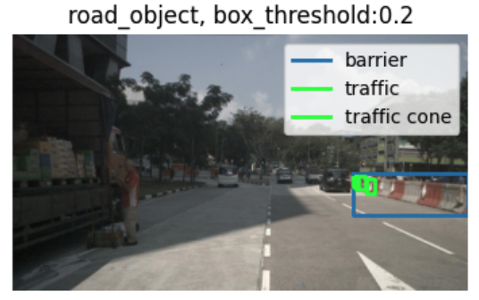
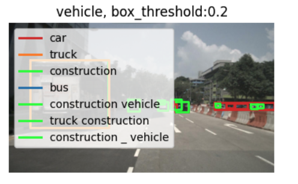

## 前処理

### 画像のオーグメンテーション

[公式実装](https://github.com/IDEA-Research/GroundingDINO/blob/main/groundingdino/util/inference.py#L39)に従うと、画像には前処理として以下が加えられています。

```python
transform = T.Compose(
    [
        T.RandomResize([800], max_size=1333),  # アスペクト比を維持したまま、短辺が800pxかつ長辺1333px以下となるようリサイズ（単一指定のためランダム性なし）
        T.ToTensor(),
        T.Normalize([0.485, 0.456, 0.406], [0.229, 0.224, 0.225]),  # ImageNet normalization
    ]
)
image_source = Image.open(image_path).convert("RGB")
image = np.asarray(image_source)
image_transformed, _ = transform(image_source, None)
```

例えばAlbumentationを使う場合も、推論前に同様の前処理（リサイズ＋normalization）が必要となります。

### テキストプロンプト

モデルクラス`groundingdino.models.GroundingDINO.groundingdino.GroundingDINO`あるいは公式の推論用関数`groundingdino.util.inference.predict`にテキストプロンプト（`caption`）を渡すとき、その渡し方には以下のパターンがありえます。それぞれのパターンについて注意点を記述します。

- 単一のラベルを渡すとき
- 複数のラベルを渡すとき
- 文章を渡すとき

#### 単一のラベルを渡すとき

単一のラベルを渡すときは、シンプルにラベル名をそのまま渡すのみでOKです。

```python
caption = "car"
predicted_boxes = predict(
    model=model,
    image=image,
    caption=caption,
    box_threshold=0.35,
    text_threshold=0.25,
)
```

#### 複数のラベルを渡すとき

**自動アノテーション用途では最も一般的なユースケース**です。

```python
classes=['car', 'truck', 'construction_vehicle', 'bus', 'trailer']
```

のように、リスト形式で指定した複数のラベルをまとめて検出したいケースが該当します。
ラベルを1つずつ分けて、上で示した単一ラベル推論を繰り返す方法も考えられますが、これだと推論時間が長くなります。
よって複数のラベルをまとめてモデルに渡しつつ、以下のような工夫を加えて推論することが推奨されます。

|前処理の内容|理由|例|
|---|---|---|
|ピリオド区切りで結合する|公式実装でも推奨|`'car. truck. construction_vehicle. bus. trailer'`|
|アンダースコアはスペースに置き換える|アンダースコアのような記号がトークナイザで|`construction_vehicle`は`construction vehicle`に置き換える|
|似た意味の単語をグルーピングして推論を分ける|ラベル数が多いと類似カテゴリ間の曖昧さや、長いテキスト列による扱いづらさが増えるため|`['barrier', 'traffic_cone', 'bicycle', 'motorcycle']`は`['barrier', 'traffic_cone']`と`['bicycle', 'motorcycle']`の2回に分けて推論する|

これらの前処理をまとめて実行する[`build_multi_label_prompt`]()関数を作成しています。

なお、公式の推論用関数`groundingdino.util.inference.predict`だとラベルが消えたり単一のBoxに複数ラベルが紐づく恐れがあるため、上記関数ではモデルから直接推論を行なっています（[後処理の項で後述]()）

##### ピリオド区切り

[公式実装](https://github.com/IDEA-Research/GroundingDINO/blob/main/groundingdino/util/inference.py#L193)では、`". ".join(classes)`でリストを結合することで、ピリオド区切りのプロンプトを作成して渡すことを推奨しています。

```python
caption = 'construction vehicle. car. bus. truck. trailer.'
predicted_boxes = predict(
    model=model,
    image=image,
    caption=caption,
    box_threshold=0.35,
    text_threshold=0.25,
)
```

##### アンダースコアはスペースに置き換える

GroundingDINOは自然言語から学習したBERTをテキストエンコーダとして用いています。よって物体検出のよくあるアンダースコアで区切られた`construction_vehicle`のようなラベルを用いた

```python
caption = 'construction_vehicle. car. bus. truck. trailer.'
```

のようなプロンプトよりも、テキストとしてより自然なスペース区切りの`construction vehicle`を用いた

```python
caption = 'construction vehicle. car. bus. truck. trailer.'
```

のようなプロンプトが好ましいです

##### ラベルの復元は公式トークナイザに頼らない

[詳しくは後述]()しますが、GroundingDINOはテキストプロンプトの文字ごとにロジット値（各ボックスと文字がどの程度適合しているかのスコア）が出力されます。

公式の推論用関数`groundingdino.util.inference.predict`では、この文字ごとのロジット値を、トークナイザを用いてラベルごとのロジット値に変換しています。
すなわち、**推論で出力されるラベルはトークナイザのトークン分割に依存**することなります。

例えば以下のようなプロンプトをトークナイザで分割してみます。

```python
caption = 'traffic cone. barrier.'
tokenized = model.tokenizer(caption)
print(tokenized.input_ids})
```

```
[101, 4026, 13171, 1012, 8803, 1012, 102]
```

101が開始、1012がピリオド、102が終了を表しており、最初のピリオドの前の要素が`4026, 13171`の2つのトークン、すなわちスペースを境に`'traffic', 'cone'`に分割されてしまっていることが分かります（スペースはトークンが割り振られることも割り振られないこともあるようです）。

これにより以下のように`traffic`という本来は存在しない分割されたラベルが判定に含まれてしまいます。



ちなみに、以下のようにアンダースコア区切りでもアンダースコアを境にトークン分割される（`2810, 1035, 4316`すなわち`'construction', '_', 'vehicle'`に分割。アンダースコア自身にもトークンが割り振られる）ので、

```python
caption = 'construction_vehicle. car. bus. truck. trailer.'
tokenized = model.tokenizer(caption)
print(tokenized.input_ids})
```

```
[101, 2810, 1035, 4316, 1012, 2482, 1012, 3902, 1012, 4744, 1012, 9117, 1012, 102]
```

こちらでも以下のように`construction`や`construction _ vehicle`のような不自然なカテゴリが生まれてしまいます（トークナイザの予期せぬ動作に加え、[後述する]()`text_threshold`の効果により複数トークンが結合されてカテゴリ名`phrase`として出力されることにも由来）



よってトークナイザに頼らず、テキスト上でラベルが区切られるインデックスを記憶する処理を追加する必要があります（`src.inference.predict_multi_labels`関数に実装済）。

ここで記憶したインデックスに基づき、後ほど[後処理でラベルごとのロジット値変換]()を実施します。

##### 似た意味の単語をグルーピングして推論を分ける

例えばnuScenesのラベル（UniAD等で使用されている[MMDetection3Dのラベル分け](https://github.com/open-mmlab/mmdetection3d/blob/v1.0.0rc6/mmdet3d/datasets/nuscenes_dataset.py#L56)）

```python
classes = [
    "car",
    "truck",
    "construction vehicle",
    "bus",
    "trailer",
    "barrier",   
    "motorcycle",
    "bicycle",
    "pedestrian",
    "trafficcone",
]
```

全てをカンマ区切りで渡してしまうと、ラベル数が多いと類似カテゴリ間の判定能力が落ちたり、長いテキスト列による推論能力の低下が懸念されます。よって以下のようにクラスを4つのグループに分け、それぞれのグループごとに別個に推論を行う（推論を4回実施）すると良いでしょう。

```python
vehicle_classes = [
    "car",
    "truck",
    "construction vehicle",
    "bus",
    "trailer",
]
road_object_classes = [
    "barrier",   
    "trafficcone",
]
two_wheeled_classes = [
    "bicycle",   
    "motorcycle",
]
pedestrian_classes = [
    "pedestrian",
]
```

## 出力形式と後処理

### モデルの出力形式

例えば以下のプロンプトを推論した場合

```python
caption="cat. dog. bird."
with torch.no_grad():
    outputs = model(image[None], captions=[prompt_definition.caption])
```

出力`outputs`は`pred_boxes`と`pred_logits`という2つの要素を持ちます。

`pred_boxes`は、以下のように各バウンディングボックス候補の座標をcxcywh形式（`[0,1]`で正規化済）で保持しています。

```python
print(outputs["pred_boxes"])
```

```
tensor([[[0.6510, 0.5599, 0.0478, 0.0660],
         [0.7171, 0.5453, 0.0150, 0.0210],
         [0.7864, 0.5498, 0.0177, 0.0250],
         ...,
         [0.4040, 0.6152, 0.0460, 0.0846],
         [0.8150, 0.2720, 0.0437, 0.0375],
         [0.9946, 0.4856, 0.0107, 0.8235]]], device='cuda:0')
```

`pred_logits`は以下のように、縦軸がBoxのインデックスを、横軸がプロンプト内の文字のインデックスを表します。すなわち、ロジット値のマトリクス内の数字は、各Boxがプロンプト内の各文字とどの程度適合しているかを表しています。

```python
print(outputs["pred_logits"])
```

```
tensor([[[-5.2351, -1.8098, -4.2007,  ...,    -inf,    -inf,    -inf],
         [-5.4965, -1.7937, -4.8030,  ...,    -inf,    -inf,    -inf],
         [-5.7055, -2.2368, -5.0508,  ...,    -inf,    -inf,    -inf],
         ...,
         [-7.1903, -6.0308, -7.2786,  ...,    -inf,    -inf,    -inf],
         [-7.2083, -6.7657, -7.2577,  ...,    -inf,    -inf,    -inf],
         [-7.2381, -7.2300, -7.5216,  ...,    -inf,    -inf,    -inf]]],
       device='cuda:0')
```

### 後処理

必要な後処理は推論結果の用途によって変わりますが、ここでは**自動アノテーションを想定して複数のラベルを渡したケース**で必要となる以下の後処理を示します。

- 余分な軸の削除と各文字ごとのスコア計算
- ラベルごとのスコアを計算
- ラベルごとスコアの最大値（Boxスコア）計算
- box_thresholdの適用

これらの後処理は前処理、推論とまとめて[`src.inference.predict_multi_labels`]()関数に実装しています。

#### 余分な軸の削除と各文字ごとのスコア計算

ロジット値にシグモイド関数を適用することで、各文字ごとのスコアに変換できます。また`pred_boxes`、`pred_logits`いずれも余分な軸が含まれるため、これを除去します

```python
token_scores = outputs["pred_logits"].cpu().sigmoid()[0]
boxes_cxcywh = outputs["pred_boxes"].cpu()[0]
```

#### ラベルごとのスコアを計算

[前処理時に記憶した]()、テキスト上でラベルが区切られるインデックスに基づき、各文字ごとのスコアをラベルごとのスコアに変換できます。
ただしモデルでの推論時にもトークナイザが適用され、その際に`[CLS]`や`[SEP]`のような特殊トークンが挿入されたりするため、記憶したインデックスの位置とモデルが出力する`pred_logits`のインデックスの位置は一致しません。
GroundingDINOにはこのようなトークナイザによるインデックス位置の変化をマッピングできる`groundingdino.util.vl_utils.create_positive_map_from_span`という関数が存在するため、これを利用して以下のようにラベルごとのスコアを計算します。

```python
tokenized = model.tokenizer(prompt_definition.caption)
    positive_map = create_positive_map_from_span(
        tokenized=tokenized,
        token_span=[
            [list(span) for span in label_spans]
            for label_spans in prompt_definition.character_spans
        ],
        max_text_len=token_scores.shape[1],
    ).to(
        device=token_scores.device,
        dtype=token_scores.dtype,
    )  # shape: (num_labels, max_text_len)
class_scores = token_scores @ positive_map.T
```

#### ラベルごとスコアの最大値（Boxスコア）計算

ラベルごとスコアの最大値を計算し、そのBoxのスコアとして用います

```python
best_scores, best_label_indices = class_scores.max(dim=1)
```

#### box_thresholdの適用

Boxスコアがbox_threshold以下のBoxを、推論の信頼性が低いものとして削除します

```python
keep = best_scores > box_threshold
kept_boxes = boxes_cxcywh[keep]
kept_scores = best_scores[keep]
kept_label_indices = best_label_indices[keep]
```

#### NMSの適用

#### その他

以後、必要に応じてBoxの座標変換等を実施してください

## パラメータ

|パラメータ名|役割|大小の意味|
|---|---|---|
|box_threshold|ボックスを検出扱いにするかどうかのスコアのしきい値|大きいと検出数が増え（Recallが上がる）、小さいと検出数が減る（Precisionが上がる）|
|text_threshold||||

### box_threshold

Grounding DINOでは、各候補ボックスについて、テキストプロンプト内の各トークンとの類似度が出力されます。


